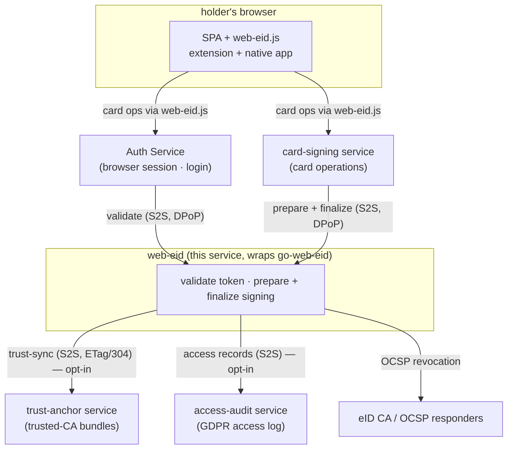
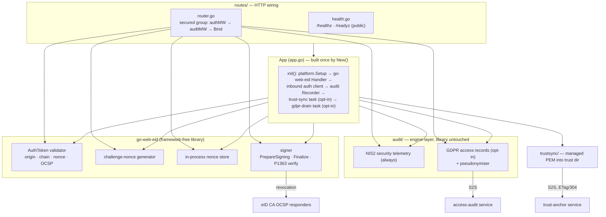
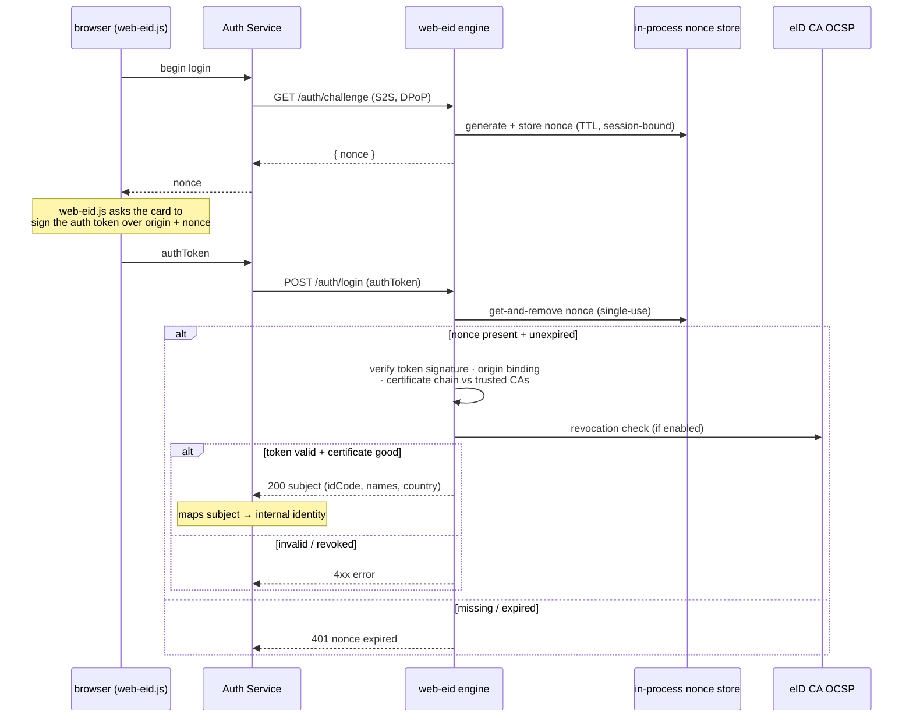
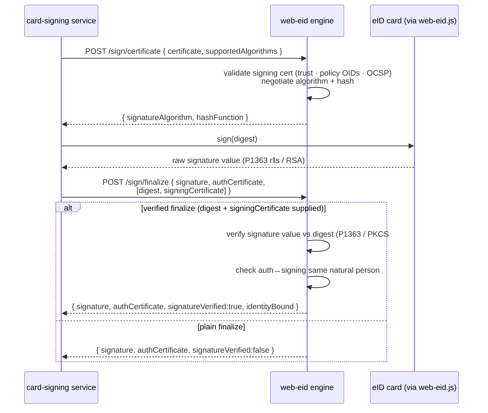

# web-eid

The eSignature-Portal **Web eID engine service** — a thin [Azugo](https://azugo.io) deployable that wraps the [`go-web-eid`](https://github.com/gmb-lib/go-web-eid) library and hosts its **Web eID authentication-token validation** and **eID-card signing-operation** endpoints behind inbound service authentication. It is the deployable counterpart of `go-web-eid`: the library does the cryptography; this service is the process that runs it, adds cross-cutting platform concerns, gates the surface with service auth, and emits audit.

It validates the Web eID authentication token a Latvian eID smart card produces — checking the token signature, the certificate chain against trusted CA material, certificate revocation over OCSP, the site-origin binding, and single-use of a challenge nonce — and it prepares and finalizes **card-based signing**: negotiating the signature algorithm and hash for a signing certificate, then returning (and optionally verifying) the card's raw signature value. Both the [Web eID authentication token protocol](https://github.com/web-eid/web-eid-system-architecture-doc) and its native-application signature conventions ([IEEE P1363](https://standards.ieee.org/ieee/1363/2049/) raw `r‖s` for ECDSA) are implemented in the wrapped library.

The engine has **no browser-facing surface**. The SPA runs the unmodified Web eID client stack (`web-eid.js` + the browser extension + the native application) and talks only to the Auth Service; the Auth Service (for login) and the card-signing service (for card operations) reach this engine **server-to-server** with a DPoP-bound service token. It renders no human UI, mounts no HTML, and — apart from its liveness/readiness probes — exposes nothing without inbound service authentication.

It does **not** issue eID cards, run a QTSP, build a signature container, or keep a durable store of identities: it processes one card presentation per request, forwards the validated subject or the signed value back to its caller, and holds only a short-lived challenge nonce in memory. Personal data from the eID certificate is never persisted; when access auditing is enabled, the national identifier is pseudonymised before any record leaves the process.

---

## Where it sits

`web-eid` is a stateless engine sidecar in a small set of services. It is never addressed by a browser. Two callers reach it over service-to-service auth: the **Auth Service** (which owns the browser session and the login flow) and the **card-signing service** (which drives the card through the prepare → sign → finalize handshake). Outbound, and both **opt-in**, it pulls trusted-CA material from the **trust-anchor** service and posts personal-data-access records to the **access-audit** service — each hop authenticated as this engine with its own DPoP-bound service token. Revocation checks reach the eID CA's **OCSP** responders directly.



Division of labour: the Auth Service owns the browser session, the challenge/response lifecycle in the stateless path, and the mapping of a validated subject to an internal identity; the card-signing service owns the card handshake and assembles the final signature container. `web-eid` owns only the cryptographic verdict — token validation, certificate-and-revocation checks, algorithm negotiation, and signature-value verification. The library stays dependency-pure; this service supplies the transport, auth, trust-material feed, observability, and audit.

---

## HTTP surface

Health probes are public; **every engine endpoint sits behind the inbound `go-authbyte` service-authentication middleware** (and, in turn, the audit middleware). The engine set is whatever `go-web-eid`'s `Handler.Bind` registers.

| Method + path | Purpose | Notes |
|---|---|---|
| `GET /healthz` | Liveness | Public; 200 whenever the process is up. Also the container health-check target (`/server health`) |
| `GET /readyz` | Readiness | Public; 503 until the engine (trust material, validator, signer) built successfully at startup |
| `GET /auth/challenge` | Issue a challenge nonce | Establishes a `Secure` `HttpOnly` `SameSite=Strict` pre-auth cookie; the nonce is bound to that browser session |
| `POST /auth/login` | Validate the authentication token (cookie-session nonce) | Consumes the stored nonce **once** (get-and-remove), validates the token, returns the validated subject (or a signed assertion when an issuer is configured) |
| `POST /auth/validate` | **Stateless** authentication-token validation | Nonce is supplied in the request body by the caller (no cookie session) — the server-to-server shape the Auth Service uses; multi-instance-safe |
| `POST /sign/certificate` | Validate the signing certificate; negotiate algorithm + hash | Checks the signing certificate against trust, policy OIDs and OCSP, then returns the negotiated `signatureAlgorithm` + `hashFunction` |
| `POST /sign/finalize` | Return the card's signed digest + auth certificate | Optionally **verified finalize**: when `digest` + `signingCertificate` are also supplied, verifies the card's signature value ([P1363](https://standards.ieee.org/ieee/1363/2049/) `r‖s` / RSA PKCS#1 v1.5 or PSS) and the auth↔signing same-natural-person binding |
| `GET /.well-known/jwks.json` | Assertion verification keys | **Only registered when assertion issuance is enabled** (an issuer is configured); absent in the default wiring |
| `GET /v1/trust-status` | Trust-identity diagnostics | Behind inbound service auth (no audit wrapper — no personal data). Reports the upstream trust snapshot id of the managed bundle on disk, `fetchedAt`/`changedAt`/`reloadedAt`, `stale` (no successful sync within two intervals) and `consecutiveFailures` (sync attempts failed in a row; 0 = last sync succeeded). `reloadedAt == changedAt` means the running engine enforces the on-disk bundle; `reloadedAt` behind `changedAt` means a reload failed and is being retried. `{"syncConfigured":false}` when trust-sync is off. Deliberately not `/readyz`: a stale bundle is old data served safely, and a degraded health status would invite a restart of a healthy process |

The `/auth/challenge` and `/auth/login` pair is the cookie-session flow; `/auth/validate` is the stateless server-to-server flow where the caller owns the challenge and nonce single-use. Both resolve to the same token validator.

---

## Architecture

One application object (`App` in [`app.go`](app.go)) wires every dependency at startup via `New()` and **fails closed** on any misconfiguration — unreadable trust material, an invalid engine config, or (when access-audit is enabled) a missing pseudonym key all stop the process from starting. One deliberate exception: with trust-sync configured, an **empty or missing** trust directory is a valid starting state (a first boot on a fresh volume) — the engine starts with an empty trusted set (every validation is refused), and the first successful sync fills and applies it; without trust-sync the default stays fail-at-start so a misconfigured path is caught at boot. All cross-cutting concerns — structured logging, correlation, tracing, metrics — are installed once by `go-platform-kit`'s `platform.Setup`; the service never wires telemetry itself.



The audit events are produced by an engine-layer middleware that **wraps** the library handlers by request path — the library is never modified. NIS2 security telemetry (via `go-sec-events`) always emits; GDPR personal-data-access records (via `go-gdpr-audit`) emit only when access-audit is configured, and always with a pseudonymised subject.

---

## Authentication-token flow

The challenge → auth-token → validation exchange. The cookie-session path (`/auth/challenge` + `/auth/login`) is shown; the stateless `/auth/validate` path is identical except the caller supplies the nonce in the body and owns its single-use.



---

## Card-signing flow

Signing is a two-call handshake around the card: the engine negotiates the algorithm for the signing certificate, the card produces the raw signature value, and the engine finalizes — optionally verifying the value and the identity binding before echoing it back. This service never assembles the signature container; it returns the signed value and the authentication certificate to the caller.



A same-natural-person **mismatch** fails the request; `identityBound:false` on success means the person binding did not apply (e.g. an organisational seal certificate), which the caller authorises separately.

---

## State and data model

The engine is **stateless by design** — no PostgreSQL, no application database, and no attribute store. The only mutable state is the **challenge-nonce store**, which is **in-process and in-memory** (`go-web-eid`'s `NewInMemoryStore`), keyed by the opaque pre-auth session id carried in the `SameSite=Strict` cookie, and TTL-bounded by `WEBEID_NONCE_TTL`. A nonce is single-use: `/auth/login` removes it as it reads it (get-and-remove), and an expired nonce is rejected.

Because that store is per-process, the cookie-session `/auth/login` flow is **single-instance** unless an external store is wired (the library supports a Redis-backed store, not enabled here — see [Known limitations](#known-limitations)). The stateless `/auth/validate` path holds no server-side nonce state and is safe to run behind multiple replicas.

Trusted-CA material is the other piece of on-disk state: a directory (`WEBEID_TRUSTED_CA_CERTS_PATH`) of intermediate CA certificates the validator and signer load at startup — and **reload on every fresh synced bundle**: when trust-sync writes a new managed bundle, the engine immediately rebuilds its trusted set from the whole directory, so a newly listed issuer's cards validate without a restart. When trust-sync is enabled it maintains one **managed** file (`00-trust-anchor.pem`) in that directory via atomic temp-and-rename, leaving any operator-added PEMs untouched; on a sync failure the existing files stay in place and the previous trusted set stays in effect (fail-safe). A bundle that is written but cannot be applied fails that sync attempt with the previous ETag kept, so the next tick refetches and retries the reload instead of confirming freshness on `304`s.

**Operator-placed certificates beside the managed bundle are a supported escape hatch — and they are named.** Any other certificate file in the trust directory is loaded and trusted alongside the managed bundle; nothing refuses to start because an operator put a certificate there. What makes that union auditable is the structured **`trust inventory`** log line, written at startup (what the engine loaded) and after every managed-bundle rewrite (what is now on disk): the managed bundle appears as a count plus a whole-file hash, while every **local** (operator-placed) certificate is named in full — origin, file, subject, fingerprint, expiry — and a file that fails to parse is named with its error. A local certificate exists nowhere but on that disk, so this log is its only record. The latest inventory line also describes what is **enforced**: every managed-bundle rewrite reloads the engine's trusted set from the directory (operator-placed files included), so the enforced set follows the disk without a restart. A locally dropped file alone does not trigger a reload — it is picked up at the next boot or the next bundle-triggered reload.

---

## Keys and trust

| Material | Role |
|---|---|
| Trusted intermediate CA certificates | Loaded from `WEBEID_TRUSTED_CA_CERTS_PATH` (file or directory); the trust store the auth-token, signing-certificate and OCSP checks anchor to. [X.509](https://www.rfc-editor.org/rfc/rfc5280) chain validation |
| OCSP responders | Reached per certificate (AIA responder URL, [RFC 6960](https://www.rfc-editor.org/rfc/rfc6960)) or a configured designated responder; responses are signature- and freshness-checked |
| Assertion signing key (optional) | Only when assertion issuance is enabled — signs the identity assertion returned by `/auth/login`; its public key is published at `/.well-known/jwks.json`. Not wired in the default deployment |

**Trust material never comes from the system cert pool.** The validator and signer trust only the certificates loaded from the configured trust directory. When enabled, trust-sync pulls that material from the trust-anchor service over the authenticated HTTP API (DPoP service token, `If-None-Match`/`304`); the engine never reads the trust-anchor database directly.

OCSP checking is defence-hardened: revocation freshness is bounded (`thisUpdate`/`nextUpdate` against an allowed clock skew and a maximum age), a random OCSP nonce is sent to responders that support it and matched on the response, and an **SSRF allowlist** (`WEBEID_OCSP_ALLOWED_RESPONDERS`) can restrict which AIA-derived responder URLs the checker will contact — the responder URL otherwise comes from the user-supplied certificate.

---

## Audit

Two independent audit streams, produced by an engine-layer middleware that wraps the library handlers:

- **Security telemetry** (`go-sec-events`, always on) — one metadata-only event per validation / signing outcome: the authenticated caller as actor, the endpoint, a coarse success/failure outcome and status. Never the eID holder's personal data.
- **Personal-data-access records** (`go-gdpr-audit`, opt-in via `ACCESS_AUDIT_URL`) — the engine processes a person's eID certificate on login and signing, so each successful operation is a personal-data access. The data-subject reference is a **pseudonym** (HMAC-SHA256 of the national identifier); the raw national id, names and certificate details are never written to the access log. Delivery is DPoP-authenticated, resilient (retries, circuit breaker, optional file outbox drained on shutdown), and **fail-open** — audit pressure never blocks a validation or a signature.

When access-audit is not configured, the security-telemetry stream still emits.

---

## Configuration

Standard platform env (`SERVER_URLS`, `SERVICE_NAME`, `ENVIRONMENT`, `LOG_*`, `METRICS_ENABLED`, `OTEL_*`) comes from the shared base configuration. Secrets support the platform remote-secret / `*_FILE` convention (used for `AUDIT_CLIENT_SECRET` and `AUDIT_SUBJECT_PSEUDONYM_KEY`).

**Inbound service auth (`go-authbyte`):**

| Env var | Default | Meaning |
|---|---|---|
| `SERVER_URLS` | `http://0.0.0.0:8080` | Bind address |
| `SERVICE_NAME` | — | Service name for logging / metrics |
| `ENVIRONMENT` | — | `development` / `staging` / `production` |
| `AUTH_ISSUER_URL` | — | Public OAuth2 issuer used to validate inbound DPoP service tokens |
| `SERVICE_AUDIENCE` | — | This service's audience (e.g. `svc:web-eid`) |

**Outbound service-to-service** (both hops mint a DPoP service token as this engine's registry client):

| Env var | Default | Meaning |
|---|---|---|
| `AUTH_OUTBOUND_ISSUER_URL` | falls back to `AUDIT_ISSUER_URL`, then `AUTH_ISSUER_URL` | In-network Auth `/token` base for outbound mints — distinct from the public `AUTH_ISSUER_URL` (unreachable inside the cluster). Used by both trust-sync and the audit poster |
| `AUDIT_ISSUER_URL` | — | Legacy alias for `AUTH_OUTBOUND_ISSUER_URL`; honoured as a fallback |
| `AUDIT_CLIENT_ID` | `svc:web-eid` | Registry client id for the outbound mints (must hold the trust-read and access-audit-write grants it uses) |
| `AUDIT_CLIENT_SECRET` | — | Secret for `AUDIT_CLIENT_ID` (remote-secret / `*_FILE` aware) |

**Trust-bundle sync (opt-in — empty `WEBEID_TRUST_ANCHOR_URL` disables it):**

| Env var | Default | Meaning |
|---|---|---|
| `WEBEID_TRUST_ANCHOR_URL` | — (empty ⇒ off) | Full trust-anchor anchors endpoint (PEM); empty disables the sync (engine then serves only operator PEMs) |
| `WEBEID_TRUST_ANCHOR_AUDIENCE` | `svc:trust-anchor` | Target audience for the trust-sync service token |
| `WEBEID_TRUST_ANCHOR_SCOPE` | `trust:read` | Scope for the trust-sync service token |
| `WEBEID_TRUST_SYNC_INTERVAL` | `1h` | Sync period (an initial sync runs at startup) |

**Access audit (opt-in — empty `ACCESS_AUDIT_URL` disables GDPR-audit):**

| Env var | Default | Meaning |
|---|---|---|
| `ACCESS_AUDIT_URL` | — (empty ⇒ off) | access-audit base; empty disables personal-data-access logging (security telemetry still emits) |
| `ACCESS_AUDIT_AUDIENCE` | `svc:access-audit` | Target audience for the access-audit service token |
| `ACCESS_AUDIT_SCOPE` | `access-audit:write` | Scope for the access-audit service token |
| `ACCESS_AUDIT_OUTBOX_DIR` | — | Optional on-disk outbox directory for durable audit buffering |
| `AUDIT_SUBJECT_PSEUDONYM_KEY` | — (required when access-audit on) | HMAC key that pseudonymises the eID national id in access records (remote-secret / `*_FILE` aware) |

**Engine (`go-web-eid`, `WEBEID_*`):**

| Env var | Default | Meaning |
|---|---|---|
| `WEBEID_ORIGIN` | — (required) | The SPA page origin(s) the token is signed over — `https://host[:port]`, comma-separated for multiple |
| `WEBEID_TRUSTED_CA_CERTS_PATH` | — (required) | File or directory of intermediate CA certs (also where trust-sync writes its managed file) |
| `WEBEID_NONCE_TTL` | `5m` | Challenge-nonce lifetime |
| `WEBEID_OCSP_ENABLED` | `true` | Toggle OCSP revocation checking |
| `WEBEID_OCSP_REQUEST_TIMEOUT` | `5s` | Per-request OCSP timeout |
| `WEBEID_OCSP_ALLOWED_RESPONDERS` | — | SSRF allowlist of OCSP responder hosts/URLs (recommended in production) |
| `WEBEID_DESIGNATED_OCSP_URL` | — | Optional designated-responder URL, overriding the certificate's AIA responder |
| `WEBEID_OCSP_NONCE_DISABLED_URLS` | — | Responder URLs that don't support the OCSP nonce extension |
| `WEBEID_SESSION_COOKIE_NAME` | `WEBEID_SESSION` | Pre-auth session cookie name |
| `WEBEID_SIGNING_HASH_PREFERENCE` | `SHA-256,SHA-384,SHA-512` | Ordered hash-function preference for algorithm negotiation |
| `WEBEID_SIGNING_ACCEPTED_POLICY_OIDS` | — | QSCD/QES acceptance gate — the signing certificate must assert at least one (e.g. LVRTC card-product policies, or the generic ETSI QCP-n-qscd `0.4.0.194112.1.2`) |
| `WEBEID_DISALLOWED_POLICY_OIDS` | Estonian Mobile-ID arcs | Anti-masquerade policy denylist |
| `WEBEID_ENFORCE_HOST_HEADER` | `false` (service override) | Reject `Host` ≠ configured origin host. The library default is `true`; this service defaults it **off** because the engine is reached server-to-server, not at the SPA origin. Set `true` only when fronting the engine at the public origin |
| `WEBEID_ALLOW_INSECURE_LOCALHOST` | `false` | Accept an `http://` localhost origin — **developer machines only** |

See [`go-web-eid`'s README](https://github.com/gmb-lib/go-web-eid) for the full engine configuration reference.

---

## Observability

`platform.Setup` wires structured logging, correlation, tracing and the Prometheus/VictoriaMetrics `/metrics` registry (toggle with `METRICS_ENABLED`, tune with `OTEL_*`). The service defines **no custom metrics**. OCSP responder calls are issued through an OpenTelemetry-instrumented transport, so revocation exchanges appear as client spans; the library itself stays telemetry-free and takes a plain `RoundTripper`.

---

## Directory layout

```
web-eid/
├── app.go              — App container: platform setup, engine handler, auth, audit, tasks
├── config.go           — configuration tree (base + inbound auth + engine + trust-sync + audit)
├── auditposter.go      — access-audit poster (DPoP service token; request + background paths)
├── testing.go          — TestApp + stub auth middleware (X-Test-Scopes) for tests
├── cmd/server/         — CLI entrypoint
│   ├── main.go         — CLI bootstrap (default SERVER_URLS, `web` default subcommand)
│   ├── web.go          — `web` subcommand: build App, register routes, run server
│   └── health.go       — `health` subcommand (container health-check probe)
├── routes/             — HTTP wiring
│   ├── router.go       — public probes + secured group (auth → audit → engine Bind)
│   └── health.go       — /healthz · /readyz
├── audit/              — engine-layer audit (library untouched)
│   ├── audit.go        — Recorder: NIS2 telemetry + GDPR access + pseudonymiser
│   ├── middleware.go   — path-matched handler wrapper emitting both streams
│   └── drain.go        — background GDPR outbox drain task
├── trustsync/          — opt-in trusted-CA bundle sync (managed PEM, ETag/304, fail-safe)
├── testdata/           — self-signed CA fixture for tests
├── Dockerfile          — static binary on rootless scratch; ENTRYPOINT /server web
└── go.mod              — module github.com/go-make-bytes/web-eid
```

---

## Development

`go-web-eid` is consumed as a **tagged module fetched from the network** (the pinned version in `go.mod`) — there is no `replace` and no sibling-copy requirement. There is no Makefile; the standard Go toolchain is the interface:

```sh
go mod tidy
go vet ./...
go build ./...
go test -race ./...
golangci-lint run ./...          # config in .golangci.yml (v2 schema)
```

Run locally (the `web` subcommand is the default):

```sh
export AUTH_ISSUER_URL=http://localhost:8080
export SERVICE_AUDIENCE=svc:web-eid
export WEBEID_ORIGIN=https://localhost:8080
export WEBEID_TRUSTED_CA_CERTS_PATH=/etc/webeid/cacerts
go run ./cmd/server
```

The unit suite runs entirely in-process: `TestApp` points the engine at the self-signed CA fixture in `testdata/`, disables OCSP egress, and installs a stub auth middleware driven by an `X-Test-Scopes` header (production wiring always uses the `go-authbyte` DPoP middleware) — no Docker or network dependency.

Container image — the build context is this module directory; `go-web-eid` is fetched from the network:

```sh
docker build -t web-eid:dev .
```

The image runs `/server web`; its health check runs `/server health`, which probes `/healthz`.

---

## Security invariants

- **Inbound service auth on the whole engine surface** — only `/healthz` and `/readyz` are public; every `/auth/*`, `/sign/*` (and the optional JWKS) route is behind the `go-authbyte` DPoP middleware.
- **Challenge nonce is single-use and TTL-bounded** — `/auth/login` removes the nonce as it reads it and rejects an expired one; the cookie is `HttpOnly`, `Secure`, `SameSite=Strict`, and the nonce is bound to that browser session (replay guard).
- **Origin binding** — the auth token is verified against the configured site origin(s); optional `Host`-header enforcement adds defence against DNS-rebinding on top of the cryptographic origin binding.
- **Signature-scheme validation is exact** — ECDSA signature values must be raw [P1363](https://standards.ieee.org/ieee/1363/2049/) `r‖s` of the curve's expected length; RSA is verified as PKCS#1 v1.5 or PSS per the negotiated algorithm; the digest length must match the named hash.
- **Identity binding** — verified finalize confirms the auth and signing certificates belong to the same natural person; a **mismatch fails** the request (a skipped binding is reported, never silently passed).
- **OCSP freshness and fail-closed revocation** — responses are signature-verified and bounded by clock-skew / max-age; a revoked certificate fails; an OCSP nonce is sent and matched where supported; an SSRF allowlist can pin responders.
- **QSCD/QES acceptance gate + anti-masquerade denylist** — signing certificates must assert an accepted policy OID; disallowed policy arcs are rejected.
- **Fail-closed startup** — bad trust material, an invalid engine config, or (with access-audit on) a missing pseudonym key stop the process from starting.
- **No personal data persisted or logged raw** — the eID national id is pseudonymised (HMAC-SHA256) before any access record; security telemetry is metadata-only.

---

## Known limitations

- **In-process nonce store** — the cookie-session `/auth/login` flow is single-instance because the challenge nonce lives in process memory; running multiple replicas of that flow needs an external (e.g. Redis-backed) store, which the library supports but this service does not wire. The stateless `/auth/validate` path has no such constraint.
- **Assertion issuance is off by default** — no issuer is configured in the default wiring, so `/auth/login` returns the bare validated subject and `/.well-known/jwks.json` is not registered. Enabling signed assertions requires wiring an issuer.
- **OCSP-only revocation** — there is no CRL fallback; when OCSP is disabled there is no revocation checking at all. The responder allowlist is empty by default (no SSRF restriction) and should be set in production.
- **Trust-sync and access-audit are both opt-in** — with trust-sync off the engine trusts only the operator-provided PEMs in the trust directory; with access-audit off no personal-data-access records are produced (security telemetry still emits).
- **No signature-container assembly** — the engine returns the card's signed value and the authentication certificate; building and validating the signature container is the caller's responsibility.

---

## Contributing

Bug reports and pull requests are welcome. [CONTRIBUTING.md](CONTRIBUTING.md) names the gate a
change has to pass, and the invariants a change to the authentication or signing path must not
weaken — every one of them is a reason a card presentation that should be refused cannot be
accepted.

Suspected vulnerabilities go through the private route in [SECURITY.md](SECURITY.md) — never a
public issue. This engine decides whether a person holding a national eID card is who the card says
they are, so that file also says which failures we treat as most serious, and where the boundary
runs between this service and the library it wraps.

## Licence

**MIT** — see [LICENSE](LICENSE).

Use it, modify it, ship it inside a commercial product; keep the copyright notice and the licence
text with it. There is no network clause here — running a modified version as a service triggers
no additional obligation.
